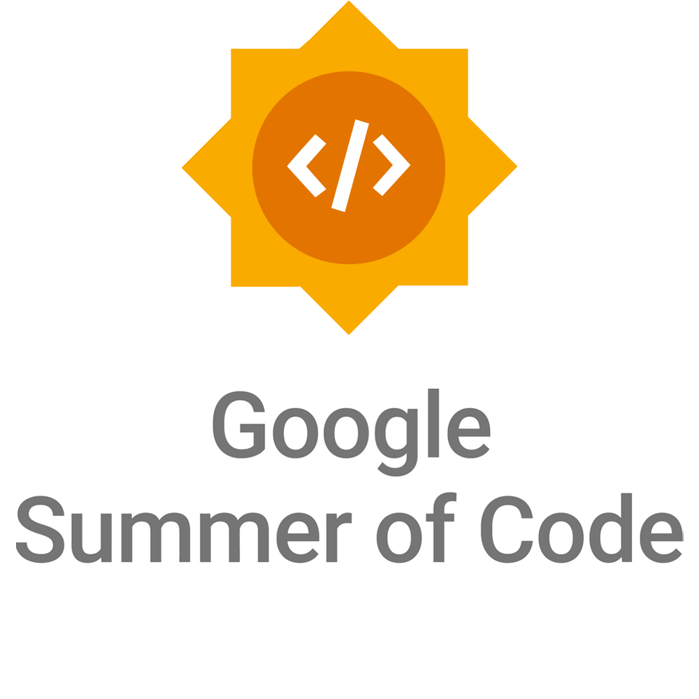

## About
Creative Machine is developed by [Jeongin Lee](https://github.com/jjeongin) under the guidance of Andres Colubri as a part of Google Summer of Code 2022 sponsored by the Processing organization. This project is heavily inspired and supported by the following open source projects: [ml5js](https://ml5js.org/), [Deep Java Library](https://github.com/deepjavalibrary/djl), [Deep Vision Processing](https://github.com/cansik/deep-vision-processing), and [TensorFlow](https://github.com/tensorflow/tensorflow).

<!--  -->

<!-- 
 -->