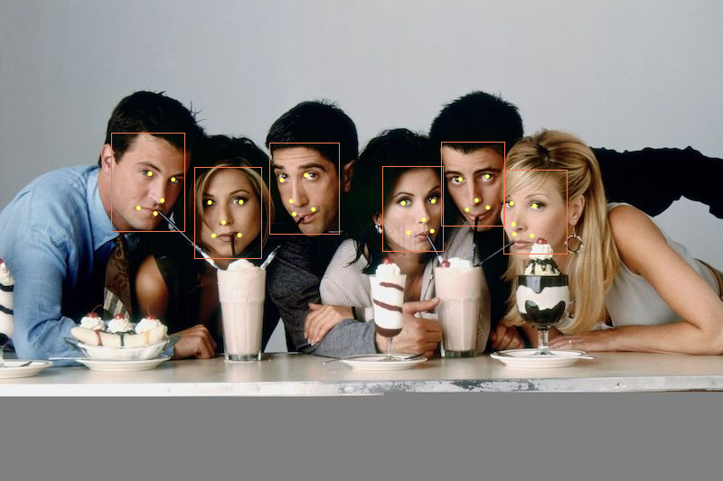

# Face Detector
Detect faces and facial landmarks on [PImage](https://processing.org/reference/PImage.html).



## Quick Start
```java
// create a Face Detection model
FaceDetector detector = new FaceDetector(this);

// load image
PImage img = loadImage("friends.jpg");

// detect pose
MLFace[] faces = detector.predict(img);
```

## Usage
### Initialize
```java
FaceDetector detector = new FaceDetector(this);
```

### Methods
### .predict(PImage image)

Detect faces and 5 facial landmarks from a [PImage](https://processing.org/reference/PImage.html) and returns an array of [MLFace](../objects/ml-face) object.

```java
// load input image
PImage img = loadImage("friends.jpg");

// run face detection
MLFace[] faces = detector.predict(img);

// plot each facial landmark (keypoint) of the detected faces
 for (int i = 0; i < faces.length; i++) {
    // get each face
    MLFace face = faces[i];
    // draw bounding box
    noFill();
    stroke(240, 121, 81);
    rect(face.getX(), face.getY(), face.getWidth(), face.getHeight());
    // draw landmarks
    noStroke();
    fill(250, 255, 112);
    for (int j = 0; j < face.getKeyPoints().size(); j++) {
        MLKeyPoint keyPoint = face.getKeyPoints().get(j);
        circle(keyPoint.getX(), keyPoint.getY(), 5);
    }
}
```
*Parameters*
- PImage image: (required) Image to run face detection on.

*Returns*
- MLFace[]: An array of [MLFace](../objects/ml-face). MLFace contains an ArrayList of 5 [MLKeyPoint](../objects/ml-keypoint). Each keypoint represents the following facial landmarks in order:
```
1. left eye
2. right eye
3. nose
4. left mouth
5. right mouth
```
Read more at [MLFace](../objects/ml-face) for how to retrieve each facial landmark easily.

## Examples
[FaceDetectorExample](https://github.com/jjeongin/ml4processing/tree/master/examples/FaceDetectorExample)

[FaceDetectorVideoExample](https://github.com/jjeongin/ml4processing/tree/master/examples/FaceDetectorVideoExample)