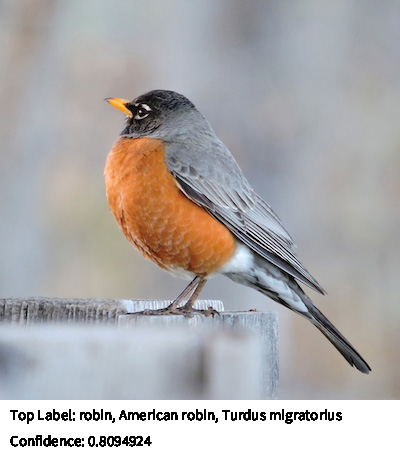

# Image Classifier
Classify an object from a [PImage](https://processing.org/reference/PImage.html).



## Quick Start
```java
// create an Image Classifier
ImageClassifier classifier = new ImageClassifier(this, "MobileNet");

// load input image
PImage img = loadImage("data/bird.jpeg");

// run image classification
MLLabel[] output = classifier.predict(img);
```

## Usage
### Initialize
```java
ImageClassifier classifier = new ImageClassifier(this, modelName);
```
#### Parameters
String modeName: (required) Model name of one of the built-in models ("MobileNet" or "Darknet").

### Model Description

### Methods
#### .predict(PImage image)

Run image classification on [PImage](https://processing.org/reference/PImage.html) and return an array of [MLLabel](../objects/ml-label.md) with image label and confidence score.
```java
// load input image
PImage img = loadImage("data/bird.jpeg");

// classify image
MLLabel[] output = classifier.predict(img);

// print the label with the highest confidence (by default, output contains top 5 labels with the highest confidence scores)
println("Label: " + output[0].getLabel() + ", Confidence: " + output[0].getConfidence());
```

*Parameters*
- PImage image: (required) Image with an object to be classified.

*Returns*
- MLLabel[]: List of [MLLabel](../objects/ml-label.md). Contains top K (default K = 5) labels and confidence scores.

## Examples
[ImageClassifierExample](https://github.com/jjeongin/ml4processing/tree/master/examples/ImageClassifierExample)
