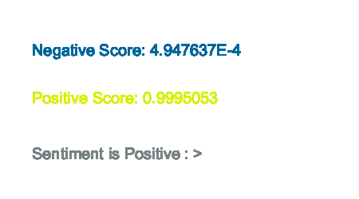

# Sentiment Analyzer
Analyze sentiment (Negative and Positive) of an input sentence.



## Quick Start
```java
// create a Sentiment Analysis model
SentimentAnalyzer analyzer = new SentimentAnalyzer(this);

// define input sentence
String input = "Machine Learning is fun.";

// run sentiment analysis
MLLabel[] output = analyzer.predict(input);
```

## Usage
### Initialize
```java
SentimentAnalyzer analyzer = new SentimentAnalyzer(this);
```

### Methods
### .predict(String input)

Runs sentiment analysis on input String and returns an array of [MLLabel](../objects/ml-label) with two sentiment labels (Negative and Positive) and confidence scores.
```java
String input = "Machine Learning is fun.";

// analyze sentiment
MLLabel[] output = analyzer.predict(input);

// print Negative score (0 to 1)
println("Sentiment: " + output[0].getLabel() + ", Confidence: " + output[0].getConfidence());

// print Positive score (0 to 1)
println("Sentiment: " + output[1].getLabel() + ", Confidence: " + output[1].getConfidence());
```
*Parameters*
- String input: (required) String to analyze the sentiment.

*Returns*
- MLLabel[]: An array of size 2 containing [MLLabel](../objects/ml-label). Each element in the array is **Negative and Positive** label with its confidence score (from 0 to 1). Confidence is higher if each sentiment is stronger.

## Examples
[SentimentAnalyzerExample](https://github.com/jjeongin/ml4processing/tree/master/examples/SentimentAnalyzerExample)
