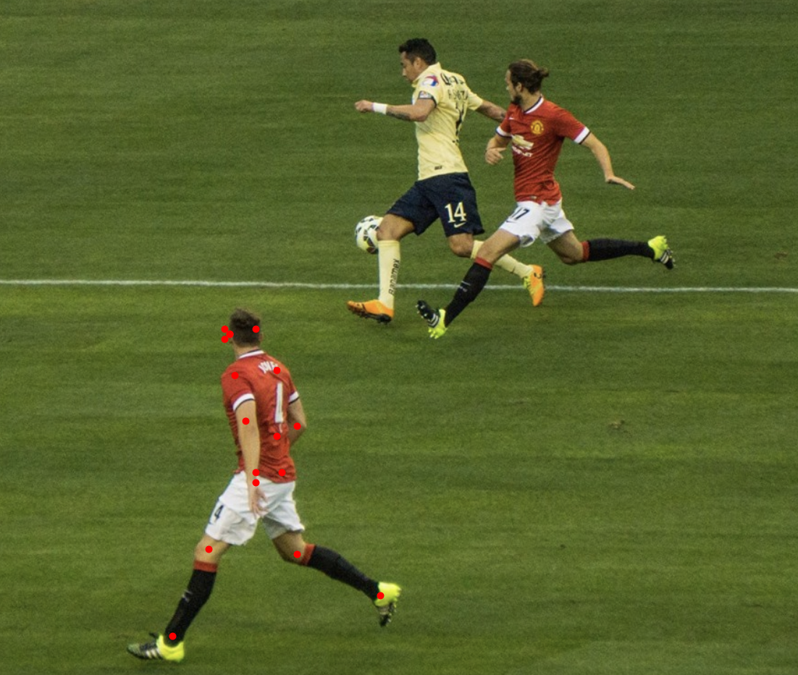

# Pose Net
Real-time pose detection on [PImage](https://processing.org/reference/PImage.html).



## Quick Start
```java
// create a Pose Detection model
PoseNet poseNet = new PoseNet(this, "ResNet");

// load image
PImage img = loadImage("pose_soccer.png");

// detect pose
MLPose pose = poseNet.predict(img);
```

## Usage
### Initialize
```java
PoseNet poseNet = new PoseNet(this, modelNameOrURL);
```
#### Parameters
String modelNameOrURL: (required) Can be a model name of built-in models ("ResNet") or a remote url/file path to a parent directory containing TensorFlow saved_model folder.
- Built-in model options: "ResNet"

### Methods
#### .detect(PImage image, Boolean saveBoundingBoxImage, String fileName)

Runs pose detection on [PImage](https://processing.org/reference/PImage.html) and returns an [MLPose]() object.

```java
// load input image
PImage img = loadImage("pose_soccer.png");

// run pose detection
MLPose pose = poseNet.predict(img);

// plot each joint (keypoint) of the detected pose
for (int i = 0; i < pose.getKeyPoints().size(); i++) {
    MLKeyPoint keypoint = pose.getKeyPoints().get(i);
    point(keypoint.getX(), keypoint.getY());
}
```
*Parameters*
- PImage image: (required) Image to run pose detection on.

*Returns*
- [MLPose](): An array list of 17 [MLKeyPoint](). Each keypoint represents the following body parts in order: 
```
1. nose
2. left eye
3. right eye
4. left ear
5. right ear
6. left shoulder
7. right shoulder
8. left elbow
9.  right elbow
10. left wrist
11. right wrist
12. left hip
13. right hip
14. left knee
15. right knee
16. left ankle
17. right ankle
```
Read more at [MLPose]() for how to retrieve each body part easily.

## Examples
[PoseNetExample](https://github.com/jjeongin/ml4processing/tree/master/examples/PoseNetExample)