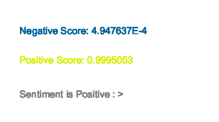

# Sentiment
Analyze sentiment (Negative and Positive) of the provided sentence.



## Quick Start
```java
// create a Sentiment Analysis model
Sentiment sentiment = new Sentiment(this, "distilbert");

// define input sentence
String input = "Machine Learning is fun.";

// run sentiment analysis
MLObject[] output = sentiment.predict(input);
```

## Usage
### Initialize
```java
Sentiment sentiment = new Sentiment(this, modelNameOrURL);
```
#### Parameters
String modelNameOrURL: (required) Can be a model name of built-in models ("distilbert") or a remote URL/file path to a parent directory containing TensorFlow saved_model folder.
- Built-in model options: "distilbert"

### Methods
#### .predict(String input)

Runs sentiment analysis on input String and returns an array of [MLObject]() with two sentiment labels (Negative and Positive) and confidence scores.
```java
String input = "Machine Learning is fun.";

// analyze sentiment
MLObject[] output = sentiment.predict(input);

// print Negative score (0 to 1)
println("Sentiment: " + output[0].getLabel() + ", Confidence: " + output[0].getConfidence());

// print Positive score (0 to 1)
println("Sentiment: " + output[1].getLabel() + ", Confidence: " + output[1].getConfidence());
```
*Parameters*
- String input: (required) String to analyze the sentiment.

*Returns*
- MLObject[]: An array of size 2 containing [MLObject](). Each element in the array is **Negative and Positive** label with its confidence score (from 0 to 1). Confidence is higher if each sentiment is stronger.

## Examples
[SentimentExample](https://github.com/jjeongin/ml4processing/tree/master/examples/SentimentExample)
